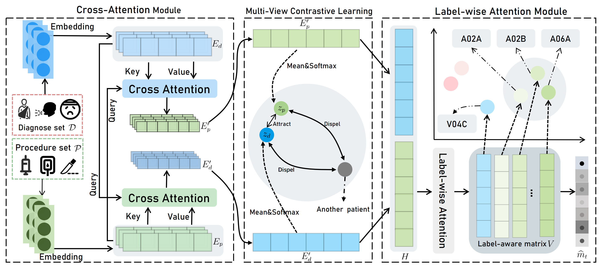

# LAMRec
LAMRec:Label-aware Multi-view Drug Recommendation



## Configuration

To set up the environment using conda, follow these steps:

1. Create a new conda environment: 

   ```
   conda create --name lamrec python=3.9
   ```

2. Activate the environment: 

   ```
   conda activate lamrec
   ```

3. Install the required dependencies: 

   ```
   pip install -r requirements.txt
   ```

## Usage

You can run and test your own model using the following code, and remember to complete your local dataset path:

```
python run.py \
  --embedding_dim 512 \
  --heads 8 \
  --num_layers 2 \
  --alpha 0.1 \
  --beta 0.1 \
  --temperature 8 \
  --lr 0.0005 \
  --epochs 50 \
  --batch_size 256 \
  --device "cuda:0" \
  --dataset "MIMIC3" \
  --dataset_path "your dataset path" \
  --dev False \
  --refresh_cache False 
```

In addition, we also provide trained model weights. You can directly run the following code to test the pre-trained model:

```
python test.py \
  --embedding_dim 512 \
  --heads 8 \
  --num_layers 2 \
  --alpha 0.1 \
  --beta 0.1 \
  --temperature 8 \
  --lr 0.0005 \
  --epochs 50 \
  --batch_size 256 \
  --device "cuda:0" \
  --dataset "MIMIC3" \
  --dataset_path "your dataset path" \
  --dev False \
  --refresh_cache False
```

## Reference

todo